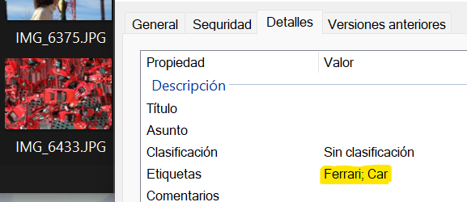
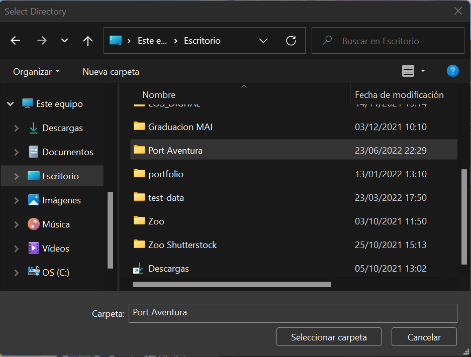
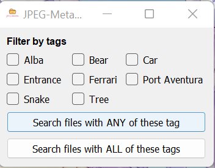
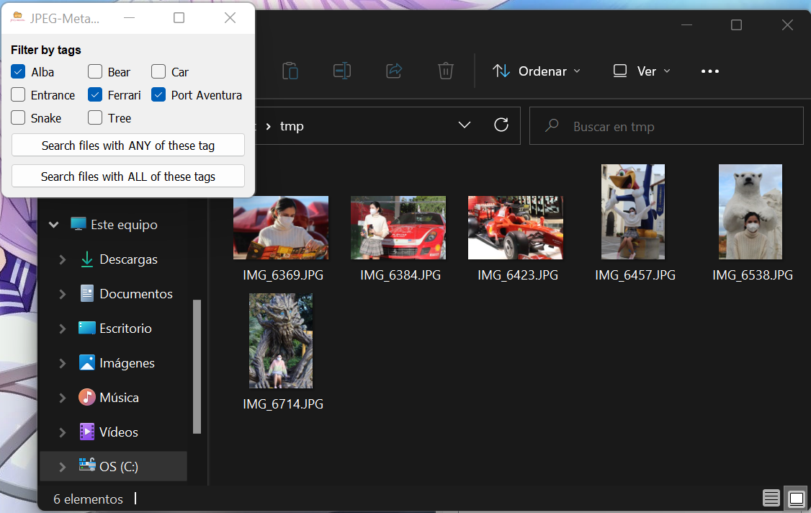

# JPEG-MetaFilter
 **JPEG-MetaFilter** is **portable** software that allows you to filter the JPEGs in your folders by their Meta-Description tags. Meta-Description tags can be added, in _Windows_ through: _Properties_ -> _Details_ -> _Description_ -> _Tags_. Opposite to folders, they can be a good way to classify images that belong to multiple categories, instead of just one. For example: [_Plastic_; _Cilindric_; _Green_; _Sold_]. With **JPEG-MetaFilter** you will be able, for instance, to search for all the image in that folder (and **subfolders**), for all the images of _pieces_ that are either _Green_ or _Plastic_, or just for only those that meet both requirements.

## Installation
**JPEG-MetaFilter** is offered as a **portable** package with **no dependencies**, compressed in an **exe** file. You can download it <a href="https://drive.google.com/file/d/1U7OVuOPJhgJpTgVOnK00yXu2VNYRr1xJ/view?usp=sharing" target="_blank">here</a>.

## Usage
**JPEG-MetaFilter** is quite easy to use:

1. Be sure that you have setted **Meta-Tags** in the images you want to _filter_.

2. Once you execute **JPEG-MetaFilter.exe** it will ask you to select the **folder** containing the **JPEGs** you want to filter.

3. It will open a window, showing all the **Meta-tags** in the **JPEGs* within the **selected folder**

4. Once you click on _Search files with [ANY/ALL] of these tags_ it will open a **window** in the **File Explorer** with the results of the filtering.

Note that the folder showing the results will be removed once the _filtering window_ is closed. Make sure to copy its content if you want to keep the results.
